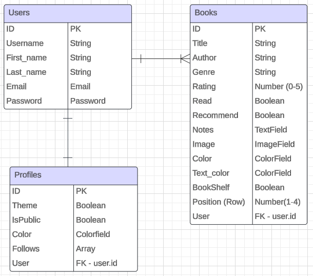
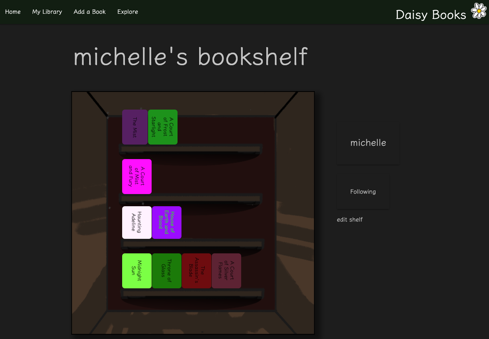
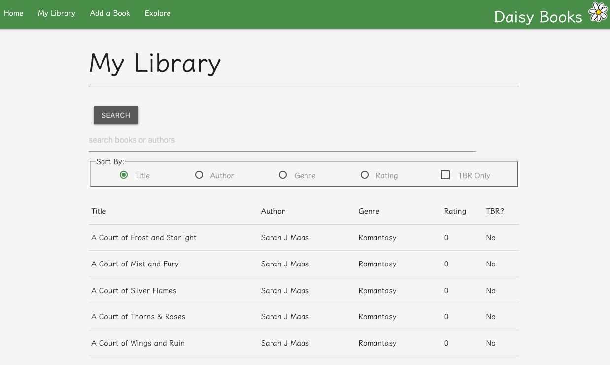
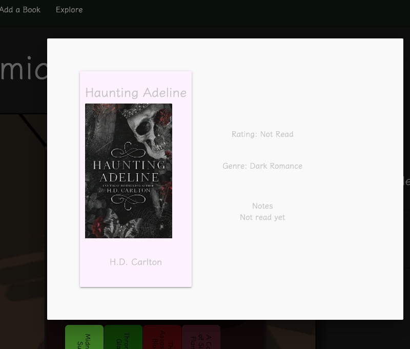

# WebBooks
A web based personal library to store the books you love, the books you hated, and the books you haven't read yet. Start a collection and customize a bookshelf to show off your favorites!

Visit the site here! https://bookdaisy.onrender.com/accounts/login/

## Models and ERD

## Wireframes

## Planning board
* https://trello.com/b/ZMBkAVE2/daisy-books

## The Site

## User Stories
* As a user (AAU) I can create and log into my own account.
* AAU I can customize light/dark mode for my account.
* AAU I can add friends and view their bookshelves.
* AAU I can add and delete books to my library.
* AAU I can update my books with images and customize the color of the book cover.
* AAU I can view a list of my books in my library and search/sort through them.
* AAU I can view my TBR list.

## Technologies Used
This project utilitizes Python and Django, and connects to a PSQL database.

## Future Features!
* Ability to edit and update personal profiles.
* More control over who can follow your account.
* Add decor to my bookshelf from provided sticker packs.
* Create multiple shelves.